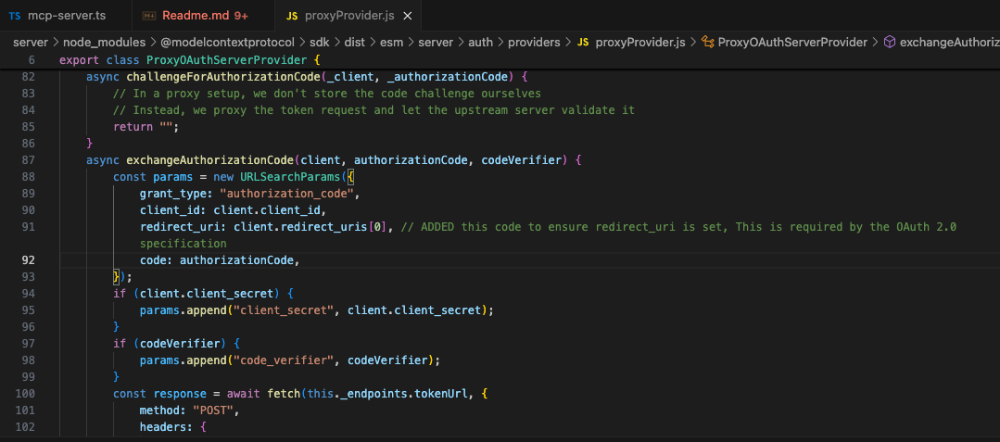

# MCP with OAuth 2.0

This repository contains the following components:

## 1. MCP Server

A test implementation of an MCP (Model Context Protocol) server that exposes:

- Tools
- Resources
- Prompts

The server is protected using **OAuth 2.0** and currently integrates with **Affinidi Login** as the external authorization provider.

---

## 2. MCP Host (Client)

A test MCP client built using **Vite** that:

- Attempts to connect to the MCP server
- Handles `401 Unauthorized` by initiating the OAuth flow
- Redirects the user for authentication via the external provider
- Upon successful authentication, can:
  - List available tools
  - Call a tool
  - Access resources

---

## 🧪 Developer Experience

This project simulates a real-world client-server authentication flow using OAuth 2.0, and provides a reference implementation for secure resource access within the MCP ecosystem.

---

## ⚠️ Known Issue

There is a known bug in the `@modelcontextprotocol/sdk` during the **authorization code exchange** flow:

- According to the OAuth 2.0 specification, the `redirect_uri` parameter **must be included**.
- However, the SDK currently omits this parameter in the token request.
- A **local modification** was made to the SDK in this repo to include the `redirect_uri`, and the flow now works as expected.

## 
